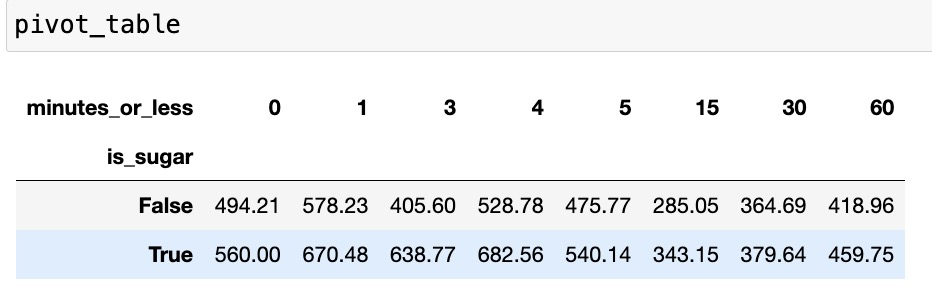

<h1>INTRODUCTION</h1>
<body>
  

    I am analyzing a dataset which contains information about various food recipes as well as their reviews gathered from [food.com](food.com) 
    By analyzing the dataset, I want to answer an extremely important question which most health freaks are looking an answer for: <strong>Does sugar as an ingredient in your recipe means the recipe will have higher calories? </strong> 
    Sugar content is a significant factor in nutritional analysis, especially given the global concerns around obesity, diabetes, and other health issues related to high sugar intake. Understanding the relationship between sugar and calorie content can provide valuable insights for healthier recipe modifications. Many consumers, like me, are interested in reducing their sugar intake for health reasons. Analyzing the impact of sugar on calorie content can help in developing recipes that cater to this demand.  
    The dataset I chose has 234429 rows and 16 columns. To answer my question specifically, I only needed 11 columns as follows:  
    <ol>
      <li>name: Recipe name</li>
      <li>id: Recipe ID</li>
      <li>minutes: Minutes to prepare recipe</li>
      <li>contributor_id: User ID who submitted this recipe</li>
      <li>nutrition: Nutrition information in the form [calories (#), total fat (PDV), sugar (PDV), sodium (PDV), protein (PDV), saturated fat (PDV), carbohydrates (PDV)]; PDV stands for “percentage of daily value”</li>
      <li>ingredients: List of ingredients</li>
      <li>rating: Rating given</li>
      <li>average_rating: Average rating</li>
      <li>minutes_or_less: It contains that the given recipe is made in _ minutes or less with the unique values [60, 4, 30, 3, 5, 15, 0, 1] where 0 is a missing value. In all except 183 cases(out of 7732), 0 is present when the recipe takes more than 60 minutes to make</li>
      <li>calories: The amount of calories in each recipe</li>
      <li>is_sugar: Does the ingredient list contain sugar?</li>
    </ol>
  

</body>

<h1>DATA CLEANING AND EXPLORATORY DATA ANALYSIS</h1>
<body>
  <h3>First, I cleaned the data</h3>
  

    For cleaning the data, I first only kept the relevant columns from a larger dataframe containing a lot of information I never used. After that, I created a new column for my dataframe called 'minutes_or_less' whose description I have given in the introduction. Furthermore, I created two new columns calorie_count and is_sugar by creating functions related to them and extracting data from already present columns. I got the resulting Dataframe's head as this:    
    
  

  <h3>Then, I conducted Univariate Analysis</h3>
  

    <iframe
  src="univariate.html"
  width="800"
  height="600"
  frameborder="0"
></iframe>
  I performed univariate analysis on the average ratings column. From this box plot, we can see the distribution of the average ratings with the maximum value being 5.0 and the minimum being 0. We can see that most ratings are concentrated between 5 and 4.5 with very less values being below 3.5.
  

  <h3>Then, I conducted Bivariate Analysis</h3>
  

      <iframe
  src="bivariate.html"
  width="800"
  height="600"
  frameborder="0"
></iframe>
    From this graph, we can see that when sugar is an ingredient, there is more calories in the recipe. When sugar is not there as an ingredient, the average calories is 393.5 while when sugar is present as an ingredient, the average calories are 474.9
  

  <h3>Lastly for EDA, I created a pivot table to analyze more data</h3>
  

    
    <iframe
  src="pivot.html"
  width="800"
  height="600"
  frameborder="0"
></iframe>
    In the pivot table, we can see as the preparation time is increasing for the dish, the calorie difference between recipes containing sugar and not containing sugar is decreasing. This can indicate that the recipes which are faster to make use sugar for a lot of their taste. Despite this, we can notice that for each preparation time, the calories for recipes with sugar is always higher.
  

</body>
<h1>ASSESSMENT OF MISSINGNESS</h1>
<body>
  

    For my dataset overall, I concluded that the 3 missing columns were description, review and rating for the initial merged dataframe. 
    For the dataframe I currently have, rating, average_rating and minute_or_less columns have missing values.  
    Out of these, I believe the ratings column was NMAR. This is because in some of the ratings which were missing, reviews still existed and they either forgot to give the rating or purposefully skipped it. We could analyze the reviews and maybe if we had more feedback from the reviewers, we could predict the ratings column.  
  

  

    Next, I tried to assess the missingness of my minutes_or_less column. For this, I first conducted a permutation test on the column with respect to the minutes column. For this, I repeated the process 10000 times to get an accurate representation oif whether the minutes_or_less column is dependent on the minutes column. I used the difference in means of missing and non missing values as my test statistic. This showed a significant relation between the 2 columns, with the p value being 0.   
    I also tried to prove that the minutes_or_less column was not dependent on the average ratings column. Again, I did a permutation test with 100000 repeitions and got a p value of around 1.0 which means the two columns are probably not dependent on each other
    <iframe
  src="missingness.html"
  width="800"
  height="600"
  frameborder="0"
></iframe>
  

</body>
<h1>HYPOTHESIS TESTING</h1>
<body>
  

    Now, I will do a hypothesis testing for my initial question I presented in the introduction.  
    <strong>Null Hypothesis: Sugar as an ingredient does not mean that the dish will have higher calories</strong> 
    <strong>Alternative Hypothesis: Sugar as an ingredient indicates that the dish will have higher calories </strong> 
    To do my permutation testing, I calculate the means of calories in recipes where sugar is present as an ingredient to the mean of calories in recipes where sugar is not present as an ingredient. After conducting the permutation test by permutating the calories column with a repetition of 10000, I got the p value as 0.0 which shows significance. This means we reject the null hypothesis. This just proves correlation between sugar and calories but we would need to do a lot of further analysis to prove causation. 
    <iframe
  src="hypothesis.html"
  width="800"
  height="600"
  frameborder="0"
></iframe>
  

</body>
<h1>Framing a prediction problem</h1>
<body>
  

    <strong>I will try to predict the number of minutes to prepare recipes. This will be a regression problem. This is not very much related to my previous problems, but I think predicting the number of minutes will be challenging so I am trying that</strong> 
    The variable I will be predicting is minutes. I chose this because while conducting bivariate analysis, it seemed like theminutes column did not have a correlation with any other columns. This will make predicting the column even tougher and I will try to do a good job at it. The metric I chose to evaluate my model is RMSE. First of all, since this is a regression problem, my 3 top choices were mean absolute error, root mean squared error and R^2. RMSE and R^2 are much more reliable metrics than MAE, and further, I chose RMSE over R^2 because RMSE provides a direct measure of the average prediction error in the same units as the response variable (minutes), making it easier to interpret the model's accuracy in terms of the actual quantity being predicted. 
    At the time of the prediction, I would have access to all the columns from the initial merged dataset except for the minutes column. These columns include: 
    <ol>
      <li>name: Recipe name</li>
      <li>id: Recipe ID</li>
      <li>minutes: Minutes to prepare recipe</li>
      <li>contributor_id: User ID who submitted this recipe</li>
      <li>nutrition: Nutrition information in the form [calories (#), total fat (PDV), sugar (PDV), sodium (PDV), protein (PDV), saturated fat (PDV), carbohydrates (PDV)]; PDV stands for “percentage of daily value”</li>
      <li>ingredients: List of ingredients</li>
      <li>n_steps: Number of steps to make the recipe</li>
      <li>n_ingredients: Number of ingredients</li>
      <li>rating: Rating given</li>
      <li>average_rating: Average rating</li>
    </ol>
  

</body>
<h1>Baseline Model</h1>
<body>
  

    Features in the model:  
    <ul>
      <li>Numerical Features: n_steps and n_ingredients. I chose these features because it seemed to me like when the number of steps in a recipe are more, it would take more time, and the same would be true for the number of ingredients</li>
      <li>Categorical Feature: Rating. Even though it contains numerical values, rating would be categorical due to it having categories. Since it is a baseline model which does not have to be perfect, I used one hot encoding for it</li>
    </ul> 
  The 'rating' feature is one-hot encoded. The performance of your model is evaluated using the Root Mean Squared Error (RMSE) metric. I believe with a current RMSE of 962.67, the model is not good. This is because it is a baseline model with a lack of feature engineering and hyperparamter fine tuning. 
  

</body>
<h1>Final Model</h1>
<body>
  

    For the final model, I chose to remove the rating feature because after further testing, it did not improve my model's accuracy. This is because most of the rating were concentrated between 4 and 5 with no correlation to the minutes column at all.  Moreover, I tested the other columns in the initial dataframe but none of them directly impacted the minutes column in any form. The two numerical features we defined in the baseline model: n_steps and n_ingredients seemed good and on top of that, I decided to add two new features by making two new columns in the dataframe. The first column was calories: which is the total number of calories in the recipe. I added this column by extracting it from the nutrition column. The second column I added was quick_recipe. I did this by first making the minutes_or_less column like I did in hypothesis testing by extracting the tag from tags column. Next, I noticed that around half of the dataset had its minutes under 30. Therefore, I created a quick recipe column by one hot encoding the minutes_or_less column. Therefore, the four feautures I used for the final model were 'n_steps', 'n_ingredients', 'calories' and 'quick_recipe' which are all numerical features.
  

</body>
<h1>Fairness Analysis</h1>
<body>
  

    I then conducted a fairness analysis to see if my model is fair or not.  
    <strong>Null Hypothesis: The model is fair. The RMSE for minutes over 1000 and minutes under 1000 is roughly the same, and any difference is due to random chance</strong> 
    <strong>Alternative Hypothesis: The model is unfair. Its RMSE is higher for the dataset when minutes are over 1000 than when the minutes are under 1000.</strong> 
    For this, my Group X would be recipes that take under a 1000 minutes and Group Y would be recipes that take over a 1000 minutes to prepare.  
    The evaluation metric I chose to conduct this fairness analysis was RMSE with the same justification I used in my framing a prediction problem section. The choice of test statistic I used was the absolute difference in the RMSE of both the groups. I ran the permutation test by permutating the minutes column(which we are predicting) with a repition of 10000. I got the resulting p_value as 0.03 which means we reject the null hypothesis. Therefore, after further analysis, I conclude that since there were over 230,000 rows with only over 1500 rows having minutes over 1000, it skewed the results for the outliers while predicting the minutes column. When we do not factor for those values, our feature of minutes_or_less column shines, giving us a much lower RMSE than when we test our model on the entire dataset. 
  

</body>

