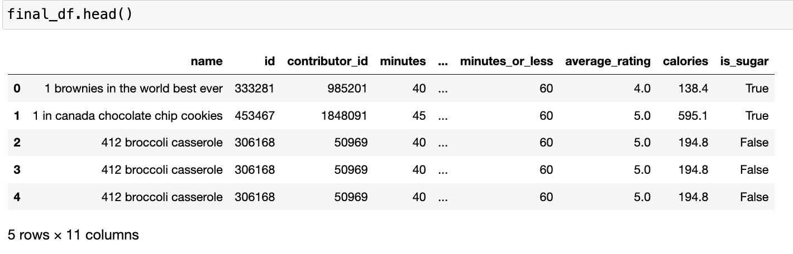

<h1>INTRODUCTION</h1>
<body>
  

    I am analyzing a dataset which contains information about various food recipes as well as their reviews gathered from [food.com](food.com) 
    By analyzing the dataset, I want to answer an extremely important question which most health freaks are looking an answer for: <strong>Does sugar as an ingredient in your recipe means the recipe will have higher calories? </strong> 
    Sugar content is a significant factor in nutritional analysis, especially given the global concerns around obesity, diabetes, and other health issues related to high sugar intake. Understanding the relationship between sugar and calorie content can provide valuable insights for healthier recipe modifications. Many consumers, like me, are interested in reducing their sugar intake for health reasons. Analyzing the impact of sugar on calorie content can help in developing recipes that cater to this demand.  
    The dataset I chose has 234429 rows and 16 columns. To answer my question specifically, I only needed 11 columns as follows:  
    <ol>
      <li>name: Recipe name</li>
      <li>id: Recipe ID</li>
      <li>minutes: Minutes to prepare recipe</li>
      <li>contributor_id: User ID who submitted this recipe</li>
      <li>nutrition: Nutrition information in the form [calories (#), total fat (PDV), sugar (PDV), sodium (PDV), protein (PDV), saturated fat (PDV), carbohydrates (PDV)]; PDV stands for “percentage of daily value”</li>
      <li>ingredients: List of ingredients</li>
      <li>rating: Rating given</li>
      <li>average_rating: Average rating</li>
      <li>minutes_or_less: It contains that the given recipe is made in _ minutes or less with the unique values [60, 4, 30, 3, 5, 15, 0, 1] where 0 is a missing value. In all except 183 cases(out of 7732), 0 is present when the recipe takes more than 60 minutes to make</li>
      <li>calories: The amount of calories in each recipe</li>
      <li>is_sugar: Does the ingredient list contain sugar?</li>
    </ol>
  

</body>

<h1>DATA CLEANING AND EXPLORATORY DATA ANALYSIS</h1>
<body>
  <h3>Part 1: Data Cleaning</h3>
  

    For cleaning the data, I first only kept the relevant columns from a larger dataframe containing a lot of information I never used. After that, I created a new column for my dataframe called 'minutes_or_less' whose description I have given in the introduction. Furthermore, I created two new columns calorie_count and is_sugar by creating functions related to them and extracting data from already present columns. I got the resulting Dataframe's head as this:  
    
  

  <h3>Part 2: Univariate Analysis</h3>
  
  
  

</body>

